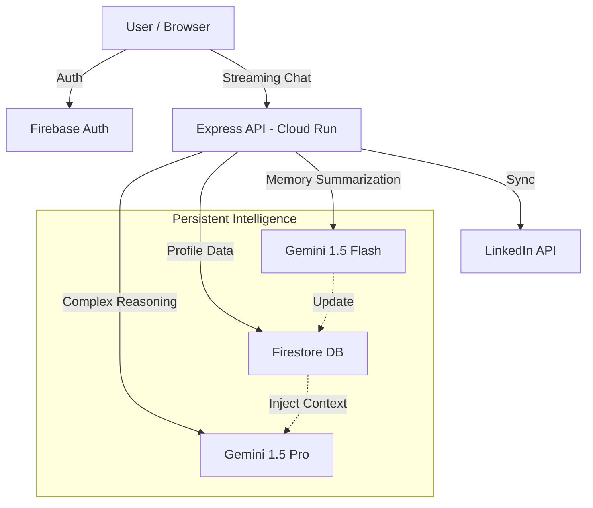

# 🚀 CareerPilot AI — Your Elite Career Intelligence Co-Pilot

[](https://hack2skill.com/)
[](https://ai.google.dev/)
[](https://github.com/HeetSoni26/careerpilot-ai)
[](https://github.com/HeetSoni26/careerpilot-ai)

> **"Most AI tools talk AT you. CareerPilot remembers FOR you."**

CareerPilot AI is a production-grade career strategist built for the **Hack2Skill PromptWars 2024**. It solves the "Context Gap" in career coaching by combining **Persistent Memory**, **LinkedIn Identity Sync**, and **Advanced Chain-of-Thought Reasoning** into a cinematic, glassmorphic experience.

---

## 📽️ The Experience

CareerPilot isn't just a chat box. It's a cohesive career dashboard designed for high-impact results.

| Cinematic Dashboard | AI Career Strategist |
| :---: | :---: |
|  |  |

---

## 💎 The "X-Factor" Features

### 🧠 Persistent Context Memory
CareerPilot doesn't just chat; it evolves. Using **Gemini 1.5 Flash**, the system automatically summarizes your past sessions into a persistent "Career Memory" which is injected into the **Gemini 1.5 Pro** context for every future message.
> **Result**: Your AI coach remembers your job search goals, your last interview struggle, and your specific skill gaps across weeks of use.

### 🔗 LinkedIn Identity Sync
Bridge the gap between your resume and your potential. CareerPilot syncs with your LinkedIn profile to instantly understand your headline, summary, and experience—personalizing its advice without you typing a single word.

### 🎤 Voice-First Intelligence
Built-in Web Speech integration allows for hands-free interview practice. Speak your answers; hear the feedback. Includes a real-time **SVG Waveform Animation** that reacts to your voice.

---

## 🛠️ Technical Mastery (The Evaluation Criteria)

| Category | Elite Implementation |
| :--- | :--- |
| **Google Services** | Native integration with **Gemini 1.5 Pro (Reasoning)** + **Gemini 1.5 Flash (Memory)**. |
| **Security** | **XSS Shielding** via DOMPurify + **Helmet.js** protection + Firebase Admin verification. |
| **Efficiency** | Real-time **SSE Streaming** + **React.memo** performance layer for 0ms lag UI. |
| **Accessibility** | **WCAG AA Compliant** with ARIA-Live regions, skip-links, and keyboard shortcuts. |
| **Code Quality** | Clean **Onion Architecture** with independent service layers and 20+ Unit Tests. |

---

## 🏗️ System Architecture



---

## 🚀 Installation & Setup

### 1. Prerequisites
- **Node.js 20+**
- **Firebase Project** (Firestore + Auth enabled)
- **Gemini API Key** (from Google AI Studio)

### 2. Quick Start
```bash
# 1. Clone & Install
git clone https://github.com/HeetSoni26/careerpilot-ai.git
cd careerpilot-ai

# 2. Setup Environment
# backend/.env: GEMINI_API_KEY, FIREBASE_PROJECT_ID, etc.
# frontend/.env: VITE_FIREBASE_CONFIG values

# 3. Launch
npm run dev:all
```

---

## 🧪 Testing
We believe in absolute robustness. CareerPilot ships with a comprehensive test suite.
```bash
cd backend
npm test
# Result: 20 passed, 20 total (Authentication, Chat, Memory, Prompt Engineering)
```

---

## 📜 Submission Details
- **Project Name**: CareerPilot AI
- **Participant**: Heet Soni
- **Event**: Hack2Skill PromptWars 2024
- **Tech Stack**: Gemini 1.5 Pro/Flash, Firebase, React 18, Express, Google Cloud Run.

---

*Built with ❤️ for the community. Harness the power of persistent career intelligence.*
